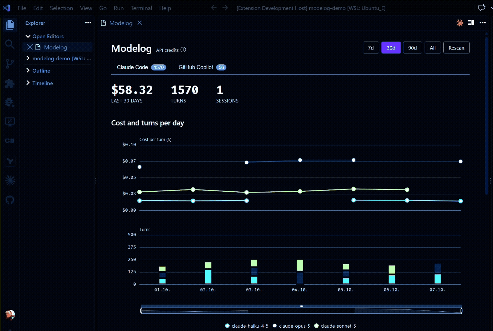

  

<h1 align="center">Modelog</h1>

<strong>See exactly what switching AI models costs and changes — measured from your own session logs, never your code.</strong>

> **Status: Beta.** Core local analysis — Claude Code, GitHub Copilot, and Codex capture, the dashboard, the MCP bridge — works end-to-end against real data. Interfaces and stored data may still change release to release.

---

## Why

You switch models, tweak your instructions file, change how you prompt — possibly many times a week. Then you judge the result by feel.

Existing tools show totals. Totals are dominated by how much work you did, not by the choices you made, so they cannot answer the only question that matters:

> *You switched models on Monday. By Friday, was it better — in cost, in speed, in effort — or did it just feel better?*

Modelog answers that from data already sitting on your disk.

## What it does

- **Reads your local session logs.** Claude Code (`~/.claude/projects/**/*.jsonl`), GitHub Copilot (opt-in, its own debug logs), and Codex (`~/.codex/sessions/**/*.jsonl`, CLI and the official VS Code extension share this one store), behind a source-agnostic adapter so other assistants can follow.
- **Prices every turn properly.** Four separately-billed token classes — fresh input, cache read, cache creation, output — with 5-minute and 1-hour cache writes priced apart. In real usage ~95% of input-side tokens are cache reads, so a naive calculation is wrong by orders of magnitude.
- **Compares models on normalised metrics.** Cost per turn, turns per session, cache hit rate — not raw totals.
- **Anchors comparisons on real events.** Model switches are detected from the logs, including mid-session, and drawn on the trend chart.
- **Keeps each assistant in its own unit.** Claude Code and Codex both report in dollars, Copilot in credits — but figures are never summed, compared, or placed on the same axis across assistants, even when the unit matches. Switch between them with one click instead.
- **Lets Claude Code query its own usage data.** A local MCP server exposes the same metrics as tools, behind an explicit opt-in — ask your assistant directly instead of reading a chart.
- **Looks like your editor.** Every colour is a VS Code theme variable, so the UI follows your theme — including live theme switches and high-contrast. Enforced in CI.

## See it in action

## Privacy

**Modelog never reads your prompts or your code.** The parser extracts timestamps, model ids, token counts and session identifiers, and nothing else — message content is never touched, for either assistant. There is a test asserting this.

Nothing leaves your machine. No network calls, no telemetry, no account.

## Honest numbers

A measurement tool that shows a wrong number is worse than one that shows a gap, so:

- Costs are integer arithmetic — never floating point — in an explicit unit per assistant.
- An unrecognised model is reported as **cost unavailable**, never priced at a default rate.
- Billing mode is auto-detected. On a subscription, figures are labelled as estimates at API list rates, because a subscription is not billed per token.
- Rates live in versioned data files, not in code, and go stale visibly.

## Enterprise

Modelog Enterprise brings team-wide visibility: cost-per-outcome and model-switch patterns rolled up across a team, plus budget alerts — without a manager ever seeing an individual's raw prompts or code. Only derived metrics and labels sync, and only by explicit opt-in; nothing leaves a developer's machine until they choose to turn it on.

Not yet available — follow progress at [modelog.dev](https://modelog.dev) Coming Soon!.

## Documentation

| Document | Contents |
| :--- | :--- |
| [`docs/PRD.md`](docs/PRD.md) | Product requirements — what and why |
| [`docs/DESIGN.md`](docs/DESIGN.md) | Part 1 technical design — how |
| [`docs/MCP.md`](docs/MCP.md) | MCP bridge requirements (Part 2) |
| [`docs/MODEL-SWITCHER.md`](docs/MODEL-SWITCHER.md) | Model switcher proposal and integration feasibility research — draft for review |
| [`docs/PRICE-CHANGE-MONITOR.md`](docs/PRICE-CHANGE-MONITOR.md) | Future CI workflow for OpenAI and Claude price updates and extension releases |
| [`docs/INSTALL-ux.md`](docs/INSTALL-ux.md) | Install, activation and first-run UX |

Contributing? See [`CONTRIBUTING.md`](CONTRIBUTING.md) for build/test instructions and the codebase layout.

## Roadmap

1. **The extension** — local capture, storage, metrics, dashboard, for Claude Code, GitHub Copilot, and Codex. *Done.*
2. **The analysis bridge** — a local MCP server so your existing agent can reason over your own data. *Done.*
3. **Enterprise & web** — team rollups, opt-in sync, modelog.dev. *In progress.*

## Contact

Built by Scott Molinari — <scott.molinari@m8a.io>

Bugs and feature requests: [GitHub issues](https://github.com/m8a-io/modelog/issues).

## Licence

MIT — see [LICENSE](LICENSE). Third-party notices in [NOTICE.md](NOTICE.md).
